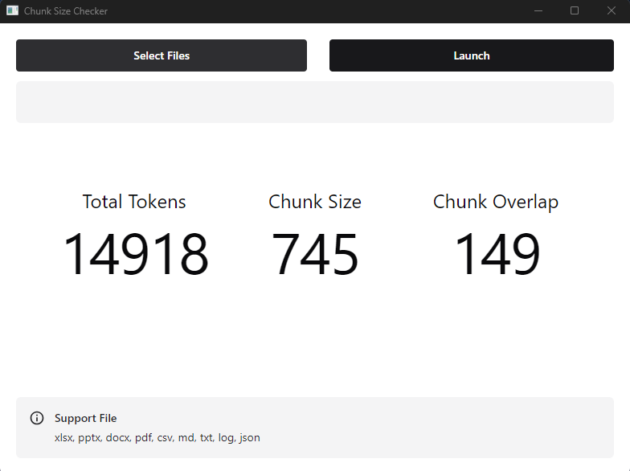

# Chunk Size Checker


Calculate the number of total tokens, optimal chunk size and chunk overlap from any given document.



## Features

- Calculate the number of total tokens, optimal chunk size and chunk overlap.
- Support multi document
- Support xlsx, pptx, docx, pdf, csv, md, txt, log, json

## Installation

### For End Users

1. Download the ChunkSize Checker latest.
2. Use it just like a normal app.

### For Developers

1. Fork the repository on GitHub.
2. Clone your forked repository to your local machine.
3. Install dependencies and run the app.

```
git clone https://github.com/yuma-shintani/chunksize-checker.git
cd chunksize-checker
npm run install
npm run dev
```

## License

This project is licensed under the MIT License. See the [LICENSE](LICENSE) file for more details.

## Contact

For any inquiries or support, please open an issue on GitHub.
